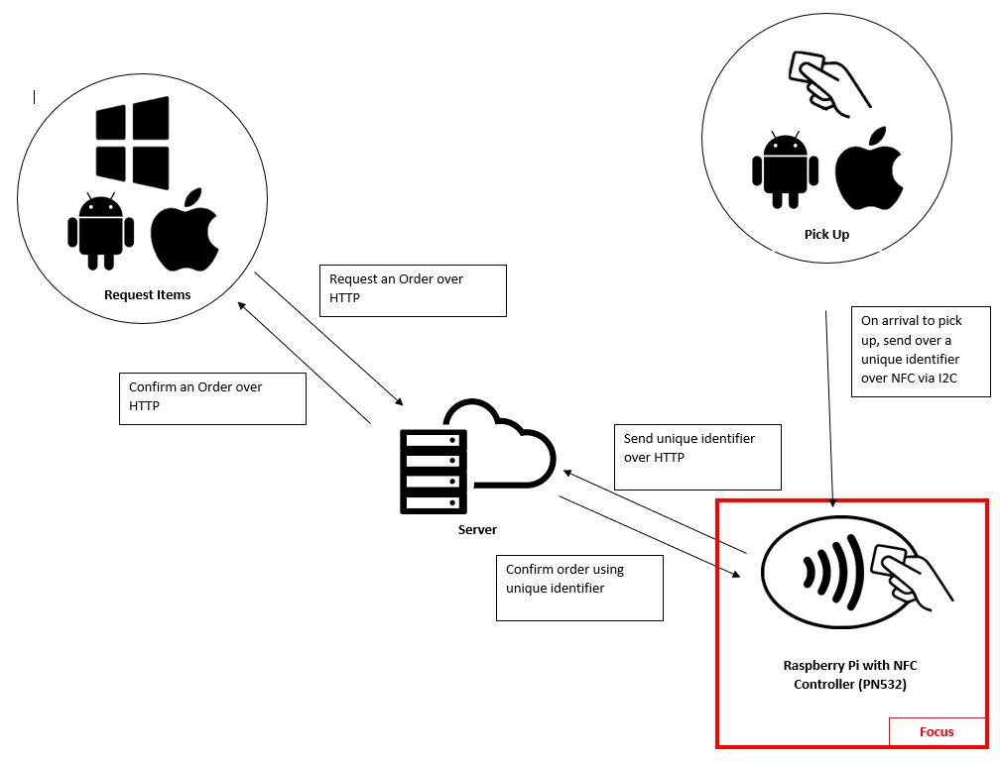
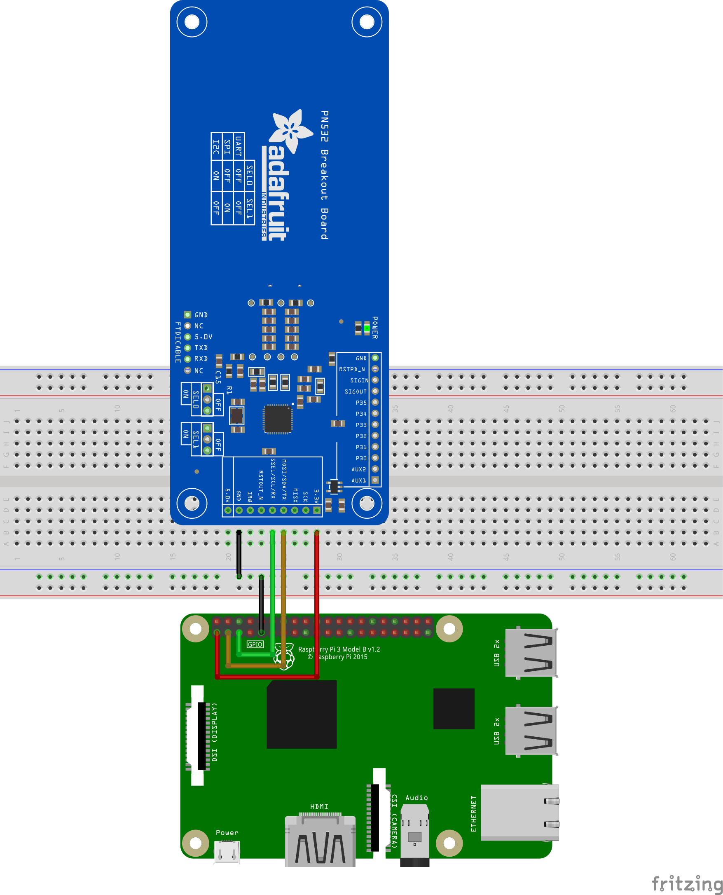

# NFCRFID Controller (Adafruit PN532)

##### Table of Contents  

- [Introduction](#introduction-using-a-system-diagram)
- [Bill of Materials and Budget](#bill-of-materials-and-budget)
- [Time Commitment](#time-commitment)
- [Raspberry Pi Headless Setup](#Raspberry-PI-Headless-Setup)
- [PN532 NFC Controller Board Soldering and Setup](#PN532-NFC-Controller-Board-Soldering-and-Setup)
- [Unit Testing NFC Controller Power Up](#Unit-Testing-NFC-Controller-Power-Up)
- [PCB Soldering](#pcb-soldering)
- [Unit Testing:PCB](#Unit-Testing-Pcb)
- [3D Printing](#3D-Printing)
- [Unit Testing : Testing Enclosed Device](#Unit-Testing-Testing-Enclosed-Device)
- [Final Assembly](#Final-Assembly)
- [Production Testing](#production-testing)


## Introduction

With the introduction of NFC, contactless payment and data transfer has become more popular over the last decade. This project is intended to deal with managing item loaning/inventory over NFC but can be used for various other projects as well. 

The modular project itself deals with 4 major components: a Raspberry Pi 2 or 3, a PCB, a NFC Controller (Adafruit PN532) and a 3D-printed enclosure. The Raspberry Pi acts as a computer so that data can be entered to or retrieved from the PN532 when an NFC device/card has been detected. To connect the 2 devices together, a PCB needs to be printed with other soldered on components. In terms of communication between the two devices, it uses a I2C protocol that has a serial data line and clock line to manage data transmission. Enclosing the entire project is a self-design 3D printed case. The case allows easy access for users to troubleshoot any problems encountered along the way of this project.




## Bill of Materials and Budget

Here is a list of the main components parts to order for the project. The total cost will depend if the parts or tools are already owned or can be loaned. Also utlizing a service such as PCB printing and 3D printing will affect the pricing. Sometimes these services are provided at a local library or prototype lab on school campuses.


<table style="width:100%">
  <tr>
    <th>Part Name</th>
    <th>Quantity</th>
    <th>Price ($)</th>
    <th>Source</th>
  </tr>
  <tr>
    <td>PN532 NFC/RFID controller breakout board - v1.6</td>
    <td>1</td>
    <td>71.42</td>
    <td>https://www.amazon.ca/gp/product/B00KKUECAO/</td>
  </tr>
  <tr>
    <td>Raspberry Pi 3 B+</td>
    <td>1</td>
    <td>114.99</td>
    <td>https://www.amazon.ca/CanaKit-Raspberry-Starter-Premium-Black/dp/B07BCC8PK7</td>
  </tr>
  <tr>
    <td>Nylon Standoffs Kit</td>
    <td>1</td>
    <td>13.99</td>
    <td>https://www.amazon.ca/gp/product/B06Y5PX9SV</td>
  </tr>
  <tr>
    <td></td>
    <td><b>Total<b></td>
    <td>200.4</td>
    <td></td>
  </tr>
</table>

**ALL PRICES LISTED ARE SUBJECT TO CHANGE.TAXES AND SHIPPING ARE NOT INCLUDED.**


To get a quote for the printed PCB visit [here](https://www.seeedstudio.com/fusion_pcb.html). Submit these [Gerber files](Electronics/FinalDocs/Gerber) for printing.

To get a quote for the 3D-printed enclosure visit [here](https://shop3d.ca/pages/upload-your-file-to-be-printed). Submit these [STL files](Documentation/Cases/2pc) for printing.


## Time Commitment

The overall time needed to complete this project will depend on the approach taken to complete it. It will mainly depend on how the PCB and 3D printed enclosure are printed and delivered. Getting it printed at a local makerspace such as a Library or Prototype lab maybe more convenient but may yield long wait times due to limited machines. Getting the PCB and enclosure printed through a reputable company would be faster, but may also introduce long delivery times if it gets held back at customs.

In terms of assembly, setup and troubleshooting the project should take approximately 2-3 hours to complete.


## Raspberry PI Headless Setup
[Use the following guide to setup your raspberry PI using the Headless Setup Method(No HDMI Display Required)](https://www.tomshardware.com/reviews/raspberry-pi-headless-setup-how-to,6028.html)

<b>Equipment Required:</b> Computer, Ethernet Cable, RPI 2 or 3, RPI Power Adapter,USB-Ethernet (if required)<br>
<b>Required Downloads:</b> Etcher, Bonjour, Putty 

<b>Guide Coverage:</b>
-	How to Image a MicroSD Card
-	Headless Wi-Fi / Ethernet
-	Direct Ethernet Connection Setup
-	Connect via SSH using Putty

<b>*Important Steps to Follow After Inital Setup:*</b>

While in `sudo rasp-config` after enabling VNC viewer, enable the I2C interface as well. This will allow the Raspberry Pi to communicate with the NFC Controller. Exit and then return to the main terminal.

Fetch the list of updates for RPI using the command: `sudo apt-get update` and then `sudo apt-get upgrade`. Enter `Y` when prompted to begin the install of the updates for the Raspberry Pi. The time to complete the download and install will vary depending on the Internet download speeds.

When the downloads are completed, download the libNFC repository by running the command:<br>

`apt-get install libnfc-bin libnfc-examples libnfc-pn53x-examples`

Configure the configuration file by running the following command: <br></br>
`sudo nano /etc/nfc/libnfc.conf`

Add the following to the bottom of the file:
```
device.name = “Pn532”
device.connstring = “pn532_i2c:/dev/i2c-1”
```
<br></br>

Here is an alternative Setup Method(With HDMI) if the headless setup does not work: https://projects.raspberrypi.org/en/projects/raspberry-pi-setting-up

<br></br>

*Important Note: When waiting for something to install, work on the other portions of the project to cut down the time to complete it.*
## PN532 NFC Controller Board Soldering and Setup

With a pair of snips create a 9-pin header and 2 3-pin headers with the provided strip of header pins. Double-check by counting the pins before cutting! The 9-Pin is for the 3V, SDA, SCL and GND. Even though only 4-pins will be utilized, it keeps the device in place when it is plugged into the female header on the PCB. The 2 other 3-Pin headers will be used for SE0 and SE1 which will help the NFC Controller decide what protocol to use since the board can work in I2C(used for this project),UART and SPI.

Feed the short side of the 9-pin header through the back of the NFC Controller. With the board resting on the long side of the pins, solder the short side to the front of the board.

Feed the short side of the 3-pin header through the front of the NFC Controller where the SE0 holes are labeled. With the board resting on the long side of the 3-pin header, solder the short side to the back of the board. Repeat this step for SE1.  

When everything has cooled down, place one jumper/shunt on SE0 on the ON position and one jumper on SE1 on the off position. This will make the NFC Controller use the I2C protocol.


## Unit Testing: NFC Controller Power Up
This is an important part of the project. Problems with setting up the NFC controller should be handled here before the full assembly.

Use the following image to wire the pi.

Red – 3.3V | Orange - SDA | Green – SCL | Black – Ground



Double check the connections before powering on the PI.

First run `i2cdetect -y 1` to see if the i2c address of the device is picked up.


Run `nfc-poll` and tap the card that was provided with the Adafruit PN532. An output should be displayed on the terminal.


## PCB Soldering


Using a 22AWG wire, strip around 1cm of wire and feed it through the via and solder both sides of the via pads to the wire. This will connect the bottom layer to top layer lines to their correlating pins. Snip off any excess wire and repeat this step for all (Vias on the PCB).

Create a 9 pin female header by cutting off one of the pins from the 10 pin females headers refer this [video](https://www.youtube.com/watch?v=qDG3VFSMSPQ) for assistance. 

Feed the (2x3)6 pin header through the bottom. Solder the 6 pin with the pins sticking up and female side sticking down so that it can connect onto the pins of the RPI.

Feed the 9 pin header through the top.Solder the 9 pin header with the pins sticking down and female side sticking up so the NFC Controller can connect to it. 

The Final PCB should look like the following.


## Unit Testing: PCB

Referring back to the PCB diagram, check for shorts, and check the continuity between the RPI Header and NFC Controller header to ensure each pin has their right connection. Using the multimeter and switching it to the continuity mode, put one probe on the 3V pin of the 6 pin stackable header and the 3v pin of the 9 pin header.If there is a beep coming from the multimeter then there is a connection, if there isn’t a beep there is something wrong with the soldering or the PCB. Repeat this step ( for SDA,SCL and GND). Also test the pin with other pins to see if there is any connection to non correlating pins, if there are, there is an issue with the PCB or soldering.


## 3D Printing

The bottom base and top portions of the enclosure can be printed with [these 2 files](). Print time will vary depending on the type of printer and printer setup.

If the casse is being printed with a publicly accessed 3D-printer with a time limit, use [the following 6 files](https://github.com/RDinh/NFCRFID/tree/master/Documentation/Cases/6pc) (1-2 hrs per part). Time may very depending on the printer setup.

Here are [the print settings in Cura](Documentation/CuraSettings.curaprofile). Download the file and import it into Cura under Profile>Manage Settings >Import


Gluing is required for the 6 pieces. To determine which part goes where place the Raspberry Pi ontop of the standoffs and place pieces in their appropriate areas. To check correct in the piece is in the correct spot refer to the stl files. 

*DO NOT GLUE THE TOP PIECES AS THEY ARE INTENDED TO BE REMOVEABLE FOR TROUBLESHOOTING.*


 


## Final Assembly

Please Follow these instructions carefully to prevent any damage to NFC Controller and the Raspberry Pi.

Place the Raspberry Pi on top of the standoffs of the 3D printed bottom base with the USB Ports facing out of the case.
Place a M2.5\*12+6 nylon Stand-off on top of the RPI Mounting Holes(screws facing up). From the bottom of the case, thread the a M2.5\*6 Screws through the holes of the RPI and into the standoffs. Repeat this step 3 more times for the remaining holes of the RPI. This step will allow for the RPI to be attached to the case while creating standoffs for the PCB to sit on.

Place a 2 M3\*20+6  Nylon Stand-offs on top of the Bottom Case(Screw Side Up) opposite to the USB ports. Thread M3\*6 them through the bottom of the case and into the standoffs. This will allow support for the bottom portion NFC Controller.


On the PCB, place two M3\*10+6 standoffs at the ends of the header. The screw side should be facing down and fastened to the PCB with two M3 nuts.


Carefully place the PCB onto the standoffs that are on top of the RPI. Fasten the section nearest the USB ports with 2 of the stacked pairs of M2.5\*12+6. Fasten the remaining two standoffs with M2.5 nuts.


Mount the PN532 NFC Controller onto the PCB using two M3*6 screws at the section nearest the USB Ports. Use two M3*12+6 standoffs (screw side up) for the section opposite the USB ports.


Attach the lid with two M2.5 nuts nearest to the USB ports and two M3 nuts opposite to the other side.  Make sure these are finger tight and not over-torqued. They will be hard to remove if any troubleshooting has to be done with the hardware later on.


## Unit Testing: Testing Enclosed Device

Follow the terminal commands listed in [Unit Testing NFC Controller Power Up](#Unit-Testing-NFC-Controller-Power-Up). This test will demostrate if the device is still operational after the assembly with the 3D printed enclosure.


## Production Testing
For a larger production of these devices, the first two unit tests can be ignored. The last unit test will be able to detect any issues. If there are issues, since the device is modular, it will be easy to take apart and troubleshoot which component was causing an issue. This method will allow to create the most devices while being able to maintain the quality of the device.


