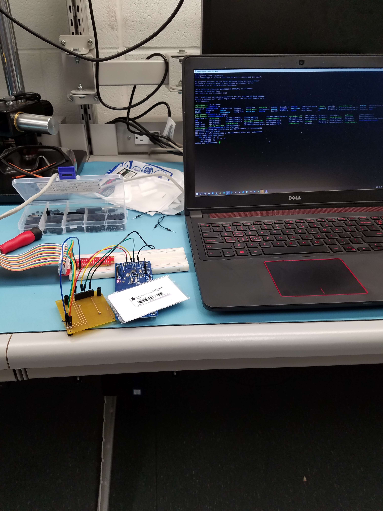
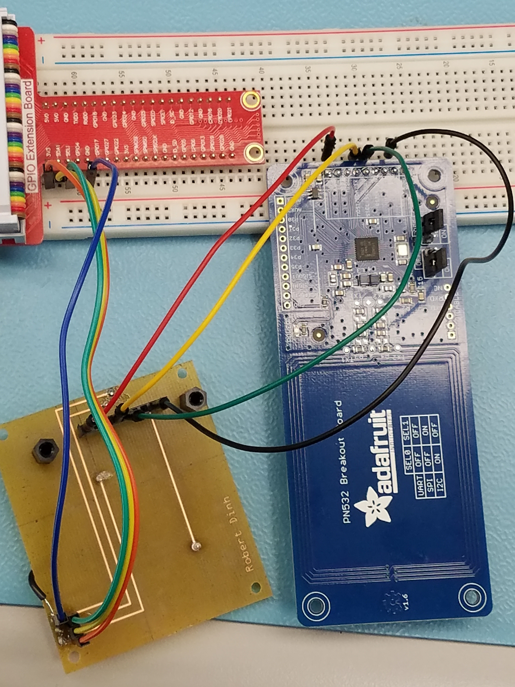
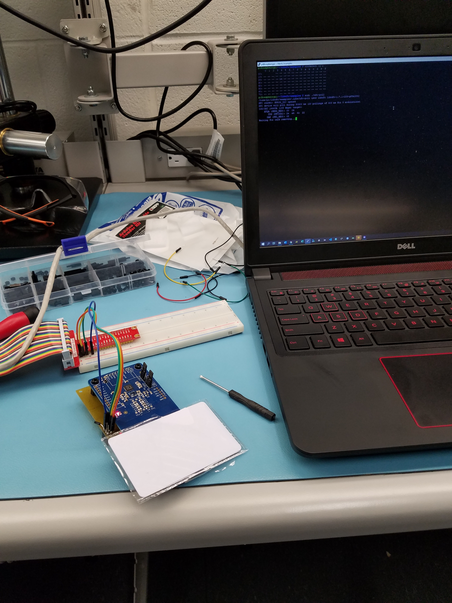
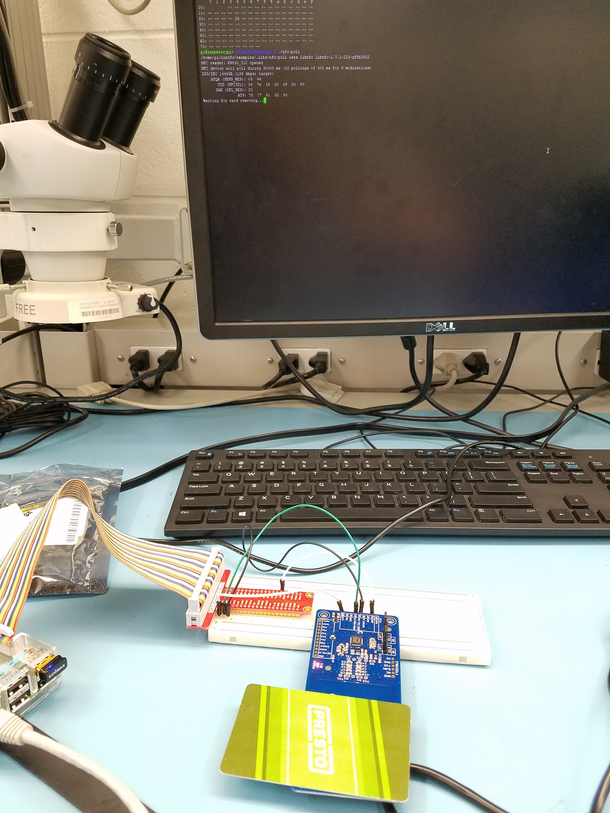
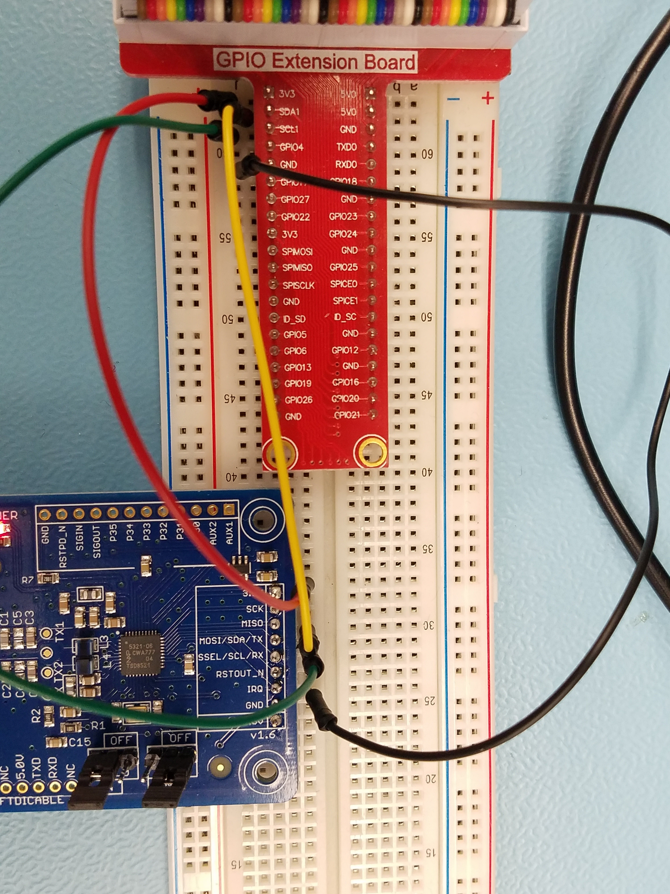

### Week 10
This week was spent mostly designing the base of the enclosure. It is the most important part where it maintains the structure of the connected devices. The base was designed in AutoDesk Inventor with imported CADs from the official raspberryPi website and with an exported PDF of the overlays of the designed PCB from Fritzing.

The base took approximately 2 hours to print using the Ultimaker 2+(at the Humber College Idea Lab) and the following images are the result. There was some damage caused to one of the standoffs for the raspberryPi due to user error when inserting the screws with too much force.

***Progress***
Some more time needs to spent designing the enclosure and assembling in Inventor before printing at the Humber Idea Lab and at a local library with 3D printers. The raspberryPi,PN532 and PCB board are operating as expected when assembled together.

The project is currently on track to being completed with the following remaining tasks:designing/printing enclosure, preparing for the project presenetation and creating the build instructions. 

***Budget***
All items currently bought are within the estimated budget for the project. The raspberryPi 2 B+ was previously owned, therefore it was not included in the following purchased items.

Here is the cost of all the bought items:

***Problems***
Currently a lot of time is spent in AutoDesk Inventor to design and assemble the enclosure. When printed the holes were a bit small for the screws to sit inside a counterbore and was not able to sit flush the printed enclosure. The holes had to be widened for the screws to be seated properly to meet the design. Adjustments will be made to the design in Inventor to mitigate this issue in the future.

### Week 9 
*Note there is an Image Orientation Bug. Sorry for the inconvenience. 

The PCB was printed using a modified design so that the enclosure would allow the RPI usb and ethernet to be usable.

Here is the modified PCB image:

Some female header pins were purchased to be soldered on to the PCB. A 10 pin was cut down to 9 pins to fit onto the PCB and the PN532. Also a 6pin stackable header provided by the Prototype Lab was soldered on to connect to the RPI.

The header pins were soldered and the vias on the PCB were connected. There was an issue with the PCB design where there was no Ground connection between the 6pin and the 9pin headers. The PCB was then modified using 22 AWG wire to connect the ground and the continunity between the all pins had been checked. The images of the soldered PCB and the modified board are posted below.

Here is the bottom side of the PCB.

Here is the top side of the PCB.

Here is the fixed PCB.

Here is the overview of the mounted PN532 on the PCB.

The PCB was then plugged into the RPI and some tests were done. Here is an image of 3.3V being measured across VCC and GND.

The PCB was then wired to the PN532 and tested to see if can read a NFC tag. Here was the result

The PN532 was then mounted onto the PN532 and tested to see if was operational. Here was the result

I am currently working on the enclosure for this project and will be able to meet the deadline on Nov. 21 2019.

### Week 8

The PN532 was wired by following the Breadboard View image found in Week 7. The following were wired from the RPI to the PN532:VCC,GND,SDA and SCL (for I2C). Upon startup and with some configurations, the PN532 was picked up by RPI using I2C. The project is currently in track to be completed.

Some standoffs,scews and nuts were recently purchased. The budget is on track and available for any other purchases.

Here is the overview of the wired breadboard and tested output.

Here is the close up image of the breadboard.

Here is a close up image of the output.

### Week 7
Version 1 of PCB has been designed. May need to make some adjustments later on. 

Nothing else has been purchased, but do plan on purchasing standoffs and additional components. The NFC breakout board has been soldered and powered out for testing.

Here is the Breadboard view:

Here is the schematic:

Here is the PCB view with the RPI and NFC breakout board(not printing this version)

Here is the final board that may be printed. Adjustmests may be made to this version of the board.

[Link to Fritzing Files](https://github.com/RDinh/NFCRFID/tree/master/Electronics)
### Week 4
Only the NFCRFID Breakout Board was purchased. The project will be developed on an exisiting RaspberryPi 2 and other equipment.

[Link to Image](https://github.com/RDinh/NFCRFID/blob/master/Images/ProofOfPurchase.jpg)
### Week 3
[Project Budget](https://github.com/RDinh/NFCRFID/blob/master/Documentation/Budget.pdf)
### Week 2
[Gantt Chart Schedule](https://github.com/RDinh/NFCRFID/blob/master/Documentation/Gantt_Chart_Schedule.pdf)
### Week 1
[Proposal Document Submission](https://github.com/RDinh/NFCRFID/tree/master/Documentation)
